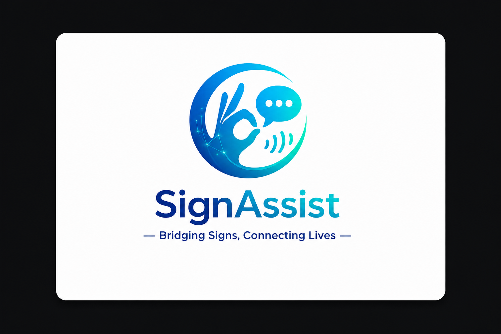
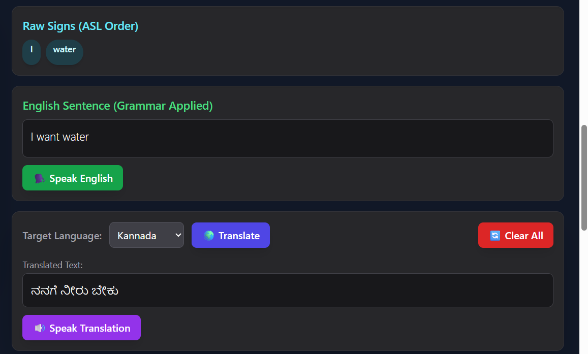
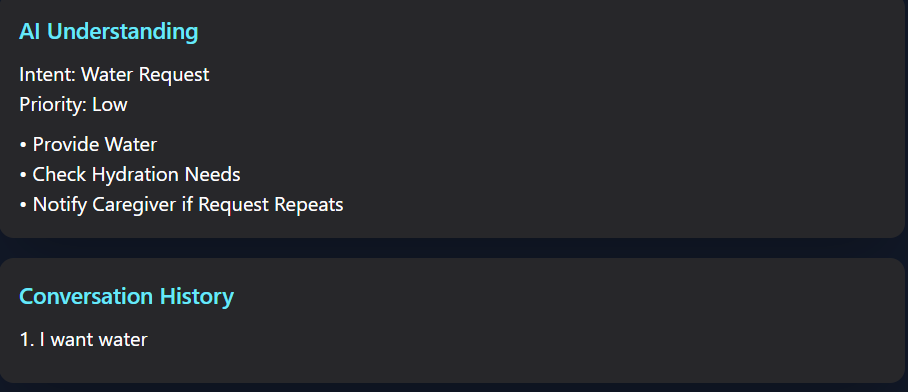
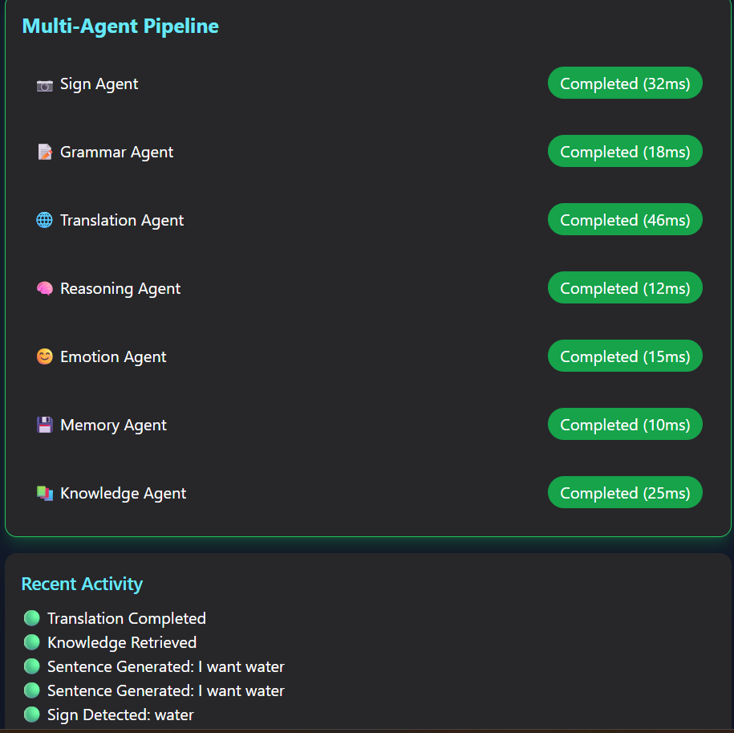
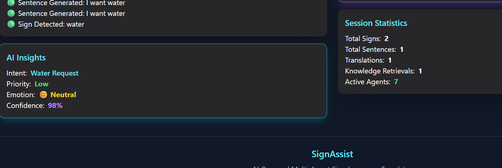
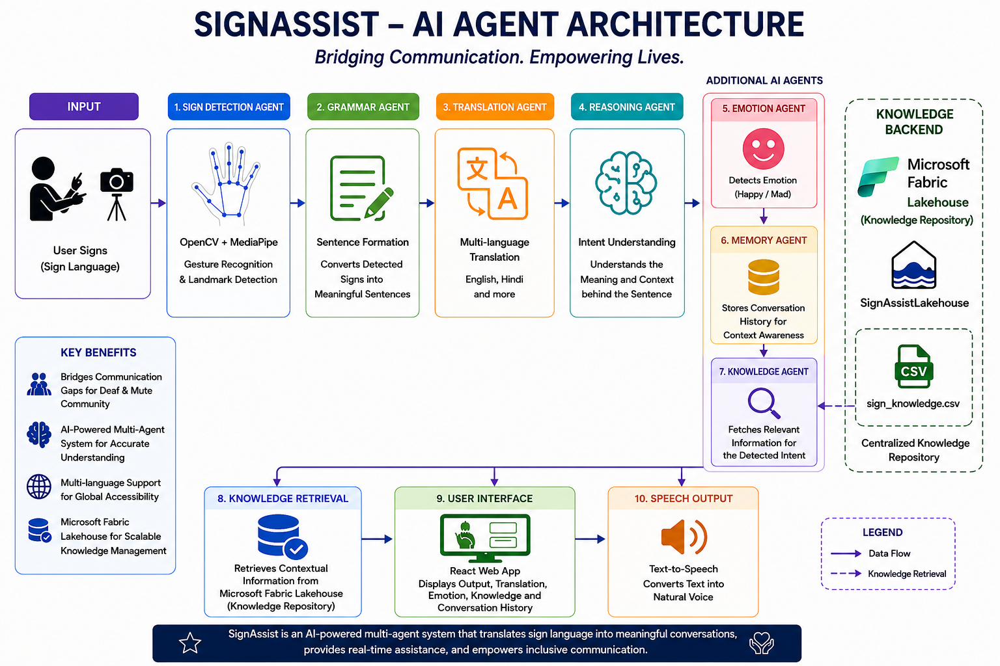
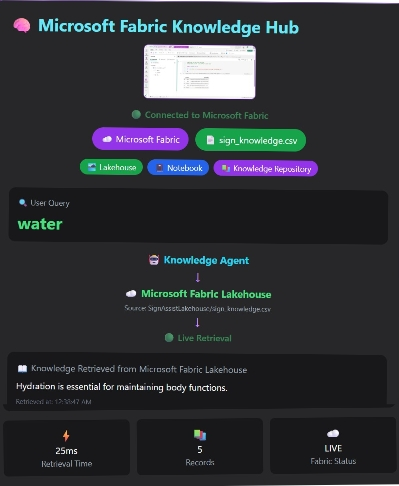
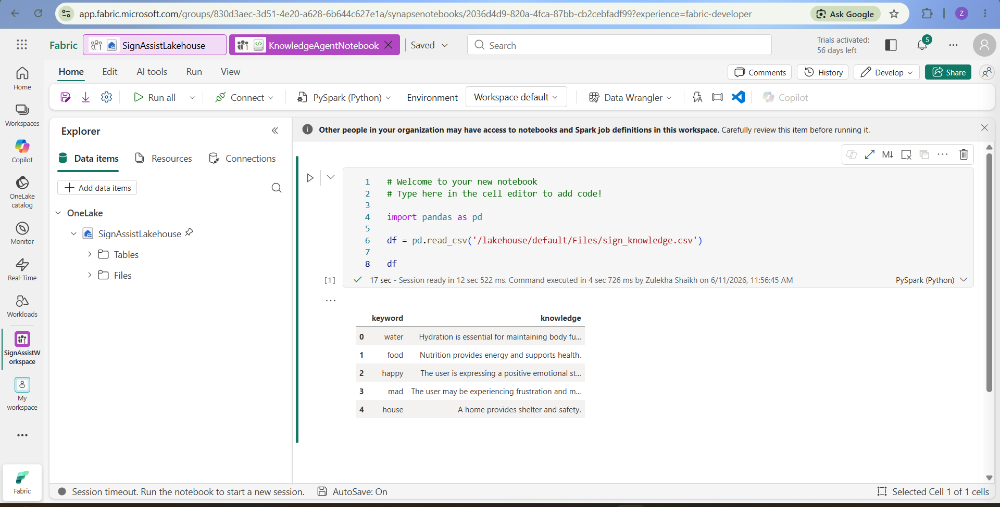

<p align="center">
  
</p>

# 🚀 SignAssist

### Bridging Communication, Empowering Lives

### AI-Powered Multi-Agent Sign Language Translation Platform

SignAssist is a real-time AI-powered sign language translation system designed to help bridge communication gaps between sign language users and people who do not understand sign language.

By combining Computer Vision, Multi-Agent AI, Natural Language Processing, Speech Synthesis, and Microsoft Fabric, SignAssist transforms sign language gestures into meaningful text, speech, contextual understanding, and knowledge-driven assistance.

---

# 🎥 Demo Video

Video Demonstration:

https://drive.google.com/file/d/1EXSm3vi7vQmg4SIOBU_ptULWzRP92EXl/view?usp=sharing

---

# 📖 About SignAssist

Millions of deaf and mute individuals face communication barriers in hospitals, schools, workplaces, government offices, and everyday social interactions.

Most existing sign language solutions focus only on gesture recognition.

SignAssist goes beyond recognition.

It understands user intent, detects emotions, remembers conversation context, retrieves knowledge from Microsoft Fabric, and provides multilingual communication support through a collaborative multi-agent architecture.

---

# ❗ Problem Statement

Communication barriers often make daily interactions difficult for members of the deaf and mute community.

Existing solutions typically:

* Focus only on gesture recognition
* Lack contextual understanding
* Do not provide emotion awareness
* Do not support memory or reasoning
* Cannot retrieve contextual knowledge

We wanted to create an intelligent assistant that not only understands signs but also understands the meaning behind them.

---

# 💡 Our Solution

SignAssist captures sign language gestures using a webcam and converts them into meaningful sentences in real time.

The generated sentence is then processed through multiple AI agents that work together to:

* Understand user intent
* Translate across languages
* Detect emotions
* Store conversation context
* Retrieve relevant knowledge
* Generate speech output

The result is an intelligent communication assistant rather than a simple sign recognition tool.

---

# ✨ Key Features

## 🎥 Real-Time Sign Recognition

* Live webcam-based gesture detection
* OpenCV + MediaPipe hand landmark tracking
* Real-time confidence scoring
* Continuous sign detection

---

## 📝 Sentence Formation

* Converts detected signs into meaningful sentences
* Grammar correction logic
* Improved readability and understanding

---

## 🌍 Multi-Language Translation

* Supports translation into multiple languages
* Enables communication across language barriers
* Real-time translation workflow

---

## 🔊 Speech Output

* Text-to-Speech generation
* Spoken communication support
* Improved accessibility

---

## 🧠 AI Reasoning Agent

* Understands user intent
* Generates contextual recommendations
* Supports intelligent decision making

---

## 😊 Emotion Analysis

Detects emotional context including:

* Happy
* Neutral
* Frustrated

---

## 💾 Memory Agent

* Stores conversation history
* Maintains contextual awareness
* Supports future interactions

---

## 📚 Knowledge Agent

* Retrieves contextual information
* Enhances user understanding
* Connected to Microsoft Fabric Lakehouse

---

# 🤖 Multi-Agent Architecture

SignAssist uses seven collaborative AI agents.

### 1. Sign Detection Agent

Detects sign language gestures from live video.

### 2. Grammar Agent

Converts raw signs into meaningful English sentences.

### 3. Translation Agent

Translates generated sentences into the selected language.

### 4. Reasoning Agent

Understands user intent and context.

### 5. Emotion Agent

Analyzes emotional state.

### 6. Memory Agent

Stores conversation history for context awareness.

### 7. Knowledge Agent

Retrieves relevant information from Microsoft Fabric.

---

# 🔄 Project Workflow

1. User performs a sign language gesture
2. Webcam captures the gesture
3. Sign Detection Agent identifies the sign
4. Grammar Agent forms a meaningful sentence
5. Translation Agent translates the sentence
6. Reasoning Agent determines user intent
7. Emotion Agent identifies emotional context
8. Memory Agent stores conversation history
9. Knowledge Agent retrieves contextual information from Microsoft Fabric
10. Final output is displayed and spoken aloud

---

# 📊 Dashboard Preview

## 🌍 Real-Time Translation Workflow



## 🧠 Context-Aware Reasoning




## 🤖 Multi-Agent Architecture




## 📈 AI Insights



---

# 🏗️ Architecture Diagram



---

# ☁️ Microsoft Fabric Integration

Microsoft Fabric serves as the centralized knowledge platform for SignAssist.

The Knowledge Agent interacts directly with Microsoft Fabric Lakehouse to retrieve contextual information.

### Fabric Components Used

* Microsoft Fabric
* Fabric Lakehouse
* Fabric Notebook
* OneLake Storage
* Knowledge Repository

### Lakehouse

```text
SignAssistLakehouse
```

### Knowledge Dataset

```text
sign_knowledge.csv
```

### Microsoft Fabric Workspace




### Fabric Notebook Execution

The Knowledge Agent retrieves contextual knowledge stored in Microsoft Fabric Lakehouse through a Fabric Notebook workflow.



---

## Knowledge Retrieval Example

| Keyword | Retrieved Knowledge                                   |
| ------- | ----------------------------------------------------- |
| water   | Hydration is essential for maintaining body functions |
| food    | Nutrition provides energy and supports health         |
| happy   | User is expressing a positive emotional state         |
| mad     | User may require assistance or support                |
| house   | A home provides shelter and safety                    |

---

## Knowledge Flow

```text
Knowledge Agent
        ↓
Microsoft Fabric Lakehouse
        ↓
sign_knowledge.csv
        ↓
Contextual Knowledge Retrieved
```

The Knowledge Agent retrieves relevant contextual information from Microsoft Fabric in real time whenever a matching keyword is detected.

This enables SignAssist to move beyond simple gesture recognition and provide intelligent, context-aware assistance.

---

# 🏆 Why SignAssist is Different

Unlike traditional sign language recognition systems,
SignAssist uses a collaborative multi-agent architecture.

✅ Understands intent

✅ Maintains conversation memory

✅ Detects emotions

✅ Retrieves knowledge from Microsoft Fabric

✅ Supports multilingual communication

✅ Generates speech output

This transforms sign recognition into an intelligent
context-aware communication assistant.

# 🛠 Technology Stack

## Frontend

* React.js
* Tailwind CSS

## Backend

* Python
* Flask

## Computer Vision

* OpenCV
* MediaPipe

## Machine Learning

* TensorFlow
* NumPy

## AI Components

* Multi-Agent Processing
* Translation APIs
* Text-to-Speech
* Intent Analysis
* Emotion Analysis

## Cloud & Data Platform

* Microsoft Fabric
* Microsoft Fabric Lakehouse
* Fabric Notebook
* OneLake

---

# 🌍 Impact

SignAssist can improve communication in:

* Hospitals
* Schools
* Workplaces
* Government Offices
* Public Services
* Community Centers

By enabling smoother interaction between sign language users and non-sign language users.

---

# ❤️ Why We Built This

We wanted to create a project that combines accessibility, artificial intelligence, and real-world impact.

Rather than building another generic AI application, we focused on solving a meaningful problem faced by millions of people worldwide.

Our goal is to demonstrate how AI can empower inclusive communication and improve everyday life.

---

# 🚀 Future Enhancements

Planned improvements include:

* Larger sign language vocabulary
* Speech-to-sign conversion
* Mobile application support
* Advanced emotion recognition
* Larger Microsoft Fabric knowledge repositories
* Healthcare integrations
* Emergency assistance workflows
* Real-time cloud synchronization

---

# 🏆 Hackathon Submission

This project was developed for the Agents League Hackathon 2026.

SignAssist demonstrates how Computer Vision, Multi-Agent AI, Accessibility Technologies, and Microsoft Fabric can work together to create an intelligent communication platform for the deaf and mute community.

---

# 👥 Team

Developed as part of the Agents League Hackathon 2026.

Thank you for taking the time to explore SignAssist.